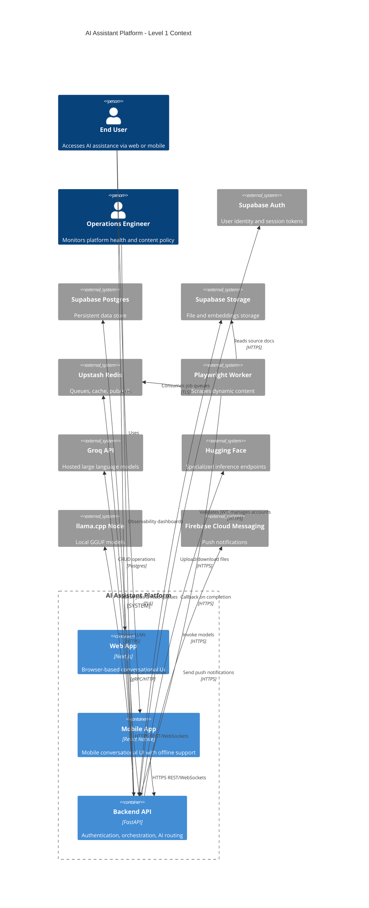

# AI Assistant Platform Architecture

## Executive Summary
The AI Assistant Platform delivers conversational and task automation experiences across web and mobile channels with a FastAPI backend, Supabase-backed persistence, Playwright-powered scraping workers, and a multi-model inference layer spanning Groq, Hugging Face, and local llama.cpp deployments. This document describes the system topology, technology stack, data flows, security posture, deployment targets, and cost-conscious operating model.

## Technology Stack Overview
| Layer | Primary Technologies | Responsibility |
| --- | --- | --- |
| Web Client | Next.js (React, TypeScript), hosted on Vercel | Responsive browser interface for chat, task execution, settings, and history. |
| Mobile Client | React Native with Expo, distributed via Expo EAS (Android APK/IPA) | Mobile-first UX with offline caching, push notifications, and voice input. |
| Backend API | FastAPI (Python), hosted on Render | GraphQL/REST API, auth orchestration, conversation routing, billing insights, model management. |
| Data Layer | Supabase (Postgres + Auth + Storage), Prisma SQL migrations | Persistent storage for users, sessions, content, files; Row-Level Security enforcement. |
| Caching & Queues | Upstash Redis (REST/WebSocket API) | Task/job queues, rate limiting, conversation cache, pub/sub for realtime updates. |
| Background Workers | Python workers running Playwright, hosted on Render Cron/Background workers | Scraping dynamic web pages, scheduled sync jobs, document ingestion. |
| Notifications | Firebase Cloud Messaging (FCM), Expo Notifications | Push messaging to mobile devices and the web (via browser notifications). |
| AI Inference | Groq API (hosted LLMs), Hugging Face Inference Endpoints, local llama.cpp (GGUF Phi-3, CodeLlama) | Model routing, fallback strategies, and cost-optimized inference. |
| Observability | OpenTelemetry, Render logs, Supabase insights, Sentry | Metrics, tracing, error reporting. |

## System Topology
- **Clients**: Next.js web app and React Native mobile app communicate via HTTPS with the FastAPI backend. Offline caches persist locally using IndexedDB (web) and SQLite/AsyncStorage (mobile).
- **Backend API**: FastAPI exposes REST + WebSocket endpoints, validates Supabase JWTs, and orchestrates queueing tasks to Redis and interactions with inference providers.
- **Workers**: Dedicated Python worker processes listen on Redis streams/queues for long-running tasks (e.g., Playwright scraping, document chunking, model fine-tuning jobs).
- **Data Stores**: Supabase Postgres holds structured data; Supabase Storage retains user-uploaded files, embeddings, and attachments; Redis caches session state and queue metadata.
- **AI Model Layer**: Backend routes prompts to Groq (high-speed text generation), Hugging Face (specialized models), or local llama.cpp-hosted GGUF models (Phi-3 for general purpose, CodeLlama for coding) running on GPU-enabled hardware or edge devices.
- **Notifications**: Backend triggers FCM topics/device tokens when important updates complete (e.g., scraping finished) and coordinates read receipts via Supabase realtime channels.

## C4 Model

### Level 1: System Context Diagram


### Level 2: Container Diagram
```mermaid
C4Container
    title AI Assistant Platform - Level 2 Containers
    Person(user, "User")

    System_Boundary(ai_system, "AI Assistant Platform") {
        Container_Boundary(client, "Client Applications") {
            Container(web, "Next.js Web App", "React/Next.js", "SPA + SSR hybrid, uses Supabase client SDK")
            Container(mobile, "Expo Mobile App", "React Native", "Offline-first mobile client")
        }
        Container(api, "FastAPI Backend", "Python", "REST & WebSocket API, authentication, orchestration")
        Container(worker, "Background Workers", "Python Playwright", "Scraping, doc ingestion, scheduled jobs")
        Container(queue, "Upstash Redis", "Redis", "Queues, cache, pub/sub channels")
        Container(db, "Supabase Postgres", "Postgres", "Transactional data, vector embeddings")
        Container(storage, "Supabase Storage", "S3-compatible", "Binary assets, attachments")
        Container(fcm, "Notification Service", "Firebase Cloud Messaging", "Push delivery to clients")
        Container(models, "Model Gateway", "AI Routing Layer", "Groq, Hugging Face, llama.cpp invocation")
    }

    Rel(user, web, "Browses, chats")
    Rel(user, mobile, "Chats, receives notifications")
    Rel(web, api, "GraphQL/REST, WebSockets")
    Rel(mobile, api, "GraphQL/REST, WebSockets")
    Rel(api, queue, "Publish job messages")
    Rel(worker, queue, "Consume jobs")
    Rel(worker, storage, "Read/write documents")
    Rel(api, db, "SQL queries via Supabase")
    Rel(api, storage, "File upload/download")
    Rel(api, fcm, "Send notifications")
    Rel(api, models, "Select and call models")
    Rel(models, groq, "Groq LLM APIs")
    Rel(models, hf, "Hugging Face endpoints")
    Rel(models, local, "llama.cpp runtime")
    Rel(web, fcm, "Browser push via FCM")
    Rel(mobile, fcm, "Mobile push via FCM")
```

## Data Model & Persistence
- **Supabase Postgres** stores relational data: users, organization memberships, conversations, message events, tool executions, documents, and audit logs. Vector embeddings for semantic search/live context are kept in a dedicated Postgres vector extension schema.
- **Supabase Auth** supplies JWTs leveraged by both clients. Row-Level Security policies ensure users only access their own or shared resources. Refresh tokens are stored securely in Supabase and mirrored in client secure storage (Keychain/Keystore).
- **Supabase Storage** retains uploaded documents and worker-generated artifacts. Objects are encrypted at rest, logically segmented by workspace.
- **Redis/Upstash** maintains ephemeral conversation state (last responses, typing indicators), rate-limit counters, and background job queues implemented with Redis Streams.

## Data Synchronization Strategy
1. **Realtime Updates**: Supabase Realtime broadcasts database change events; web/mobile clients subscribe for conversation updates, ensuring low-latency synchronization.
2. **Event Sourcing Overlay**: Messages and tool responses are appended to an event log table; clients reconcile via incremental sync endpoints with `updated_at` cursors.
3. **Conflict Resolution**: Clients transmit vector clocks for conversation edits; FastAPI resolves with last-write-wins semantics plus audit trail for manual reconciliation.
4. **File Consistency**: File uploads return signed URLs; workers emit completion events to Redis, which the backend pushes to clients via WebSocket to refresh file metadata.

## Offline Support Plan
- **Web (Next.js PWA)**: Service workers cache shell assets and recent conversations using IndexedDB. When offline, requests queue in IndexedDB; once online, a synchronization task flushes queued mutations via the API.
- **Mobile (React Native)**: Utilizes Expo SQLite/AsyncStorage to store last N conversation threads, prompts, and settings. Fallback UI indicates offline status and replays queued messages when connectivity resumes.
- **Graceful Degradation**: AI inference requests are deferred while offline; users can mark prompts for later processing. Local inference via on-device llama.cpp (optional advanced mode) allows limited offline replies for text completions.

## AI Model Routing Logic
- **Routing Criteria**: Task type, latency tolerance, cost budget, and compliance tier determine model selection.
  - **Groq (Mixtral, Llama-3)** for latency-sensitive chat responses and coding assistance within free-tier limits.
  - **Hugging Face Endpoints** for specialized tasks (summarization, document Q&A) that require fine-tuned models; invoked sparingly due to per-call charges.
  - **Local llama.cpp GGUF (Phi-3/CodeLlama)** for offline or cost-sensitive scenarios; invoked when workloads exceed external API quotas or when data residency constraints require on-prem processing.
- **Controller Pipeline**: Requests enter a policy engine (FastAPI dependency) that enforces rate limits, redacts PII, and chooses a model. Responses are cached in Redis; fallback cascading ensures failure on one provider escalates to the next configured route.
- **Observability**: The routing component emits structured logs and metrics (latency, cost) to OpenTelemetry to guide optimization.

## Background Workers & Integrations
- Workers run on Render (background services) and execute Playwright scripts for authenticated scraping, scheduled via cron triggers.
- Document ingestion pipeline: uploads -> queue message -> worker downloads file -> extracts text -> generates embeddings via Hugging Face or local model -> stores results in Supabase -> notifies user through WebSocket + push.
- Workers also manage daily model health checks, queue compaction, and push analytics to Supabase.

## Notifications & Re-engagement
- FastAPI issues FCM notifications through topic or device tokens for conversation updates, scheduled reminders, and ingestion completions.
- Expo Notification service handles platform-specific token registration. The web client uses FCM web push for critical events, respecting browser permission flows.

## Deployment Targets
| Component | Target | Notes |
| --- | --- | --- |
| FastAPI Backend & Model Gateway | Render Web Service (auto-deploy from Git) | Autoscaling based on request volume; background worker services on Render for Playwright. |
| Background Workers | Render Background Workers / Cron Jobs | Separate instance class optimized for headless browsers. |
| Next.js Web App | Vercel | Edge network for SSR, environment variables managed via Vercel secrets. |
| React Native Mobile App | Expo EAS Build & Submit | Android APK (free tier) + optional TestFlight distribution. |
| Supabase | Supabase Managed Hosting | Provides Postgres, Auth, Storage, Edge Functions if needed. |
| Redis Queues | Upstash (serverless) | Serverless Redis with HTTPS access; integrates with serverless environments. |
| llama.cpp Runtime | Self-managed GPU host (Render GPU or on-prem) | Exposed via authenticated gRPC/HTTP for backend access. |

## Security & Privacy Considerations
- **Authentication & Authorization**: Supabase Auth with JWT validates all requests; FastAPI dependencies enforce scopes, roles, and workspace membership. Admin actions require multi-factor authentication.
- **Data Protection**: TLS enforced end-to-end. Supabase encrypts data at rest; additional app-layer encryption used for highly sensitive documents. Redis connections use TLS with ACLs. Secrets stored in Render/Vercel secret managers.
- **Least Privilege**: Service accounts restricted per environment. Workers use scoped API keys with limited Supabase policies.
- **PII Handling**: Requests undergo preprocessing to mask PII before logging or transmitting to third-party models unless explicit consent is given. Local llama.cpp preferred for PII-containing prompts.
- **Audit & Compliance**: All administrative actions logged to a compliance table with timestamp, actor, and outcome. Retention policies align with GDPR/CCPA (data export & deletion workflows).
- **Environment Isolation**: Separate Supabase projects and Upstash instances for dev/staging/prod. CI/CD uses ephemeral preview deployments.

## Observability & Reliability
- OpenTelemetry traces instrument backend endpoints and worker jobs, exporting to a managed backend (e.g., Honeycomb free tier).
- Structured logs aggregated via Render log drains and Supabase Functions for analytics.
- Health checks on model endpoints; circuit breakers trip when providers degrade, triggering fallback routes.
- Chaos drills and auto-retries built atop Redis Streams with dead-letter queues.

## Cost & Free-Tier Compliance
- **Render**: Leverage free tier for lightweight FastAPI instance and background worker during early development; scale to paid plans as load increases.
- **Vercel**: Hobby tier supports Next.js web app with preview deployments, mindful of bandwidth limits.
- **Supabase**: Free tier covers up to 500MB database/storage and 50K monthly active users; implement retention to stay within quotas.
- **Upstash Redis**: Serverless free tier supports limited requests/day; batch operations and TTL caching reduce usage.
- **Groq/Hugging Face**: Track per-call costs via routing metrics; enforce quotas and prefer local models when thresholds reached.
- **Firebase Cloud Messaging**: Free usage for push notifications.
- **llama.cpp**: Runs on self-hosted hardware; leverage idle GPU/CPU resources to avoid additional SaaS costs.
- **Optimization**: Automatic archiving of old conversations, batched worker tasks, and dynamic throttling based on spending guards keep the platform within free-tier constraints while scaling.

## Roadmap Considerations
- Introduce feature flag service (e.g., Supabase Edge Functions) to roll out experimental model routing strategies.
- Evaluate edge inference offloading to WebAssembly for on-device experimentation.
- Expand compliance tooling with DLP scanning on file uploads.

---

*Document version: 1.0 — October 28, 2024*
