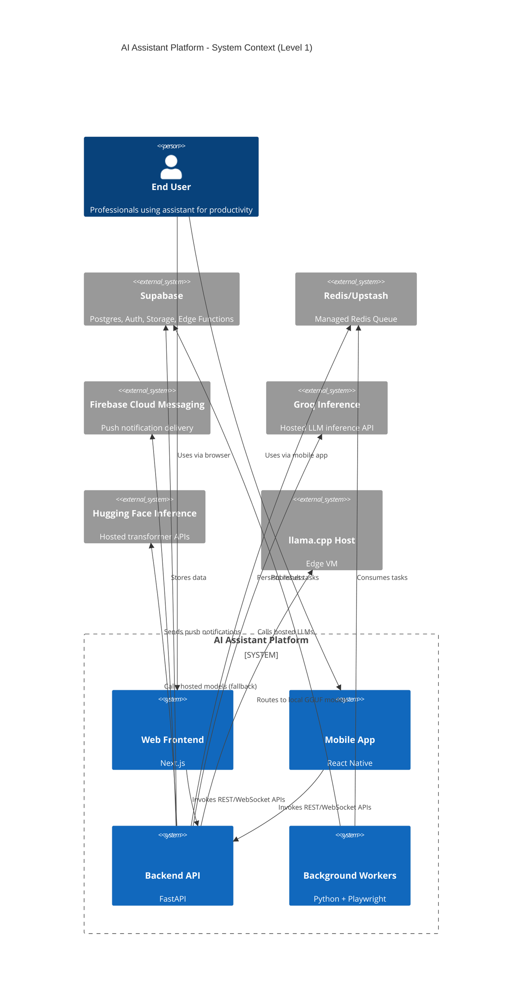
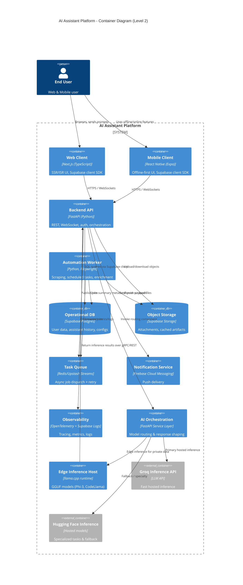

# AI Assistant Platform Architecture

## 1. Executive Summary
The AI Assistant Platform delivers a unified productivity companion across web and mobile channels, powered by a FastAPI backend, event-driven workers, and multi-model AI orchestration. Supabase provides managed Postgres, authentication, and object storage, while Redis/Upstash coordinates asynchronous workloads. Real-time sync, offline resilience, and smart model routing ensure the assistant remains responsive and cost-efficient within free-tier constraints.

## 2. Goals and Non-Functional Requirements
- **User Experience**: Responsive, real-time assistance with graceful offline behavior on mobile and web.
- **Scalability**: Horizontally scalable stateless services and queue-based background processing.
- **Security & Privacy**: Role-based access control, encrypted storage/transport, and privacy-by-design data minimization.
- **Cost Efficiency**: Operate primarily within free-tier allowances of hosting, storage, and third-party AI APIs.
- **Maintainability**: Clear separation of concerns, automated deployments, and observability hooks.

## 3. System Context (C4 Level 1)

## 4. Container Overview (C4 Level 2)

## 5. Component Responsibilities
### 5.1 Frontend Web (Next.js)
- Server-rendered UI hosted on Vercel with ISR for public marketing and dashboard pages.
- Uses Supabase JS SDK for auth/session management and real-time subscriptions.
- Integrates with API through HTTPS and secure WebSockets for streaming responses.
- Employs SWR/React Query for caching and offline fallback in supported browsers.

### 5.2 Mobile App (React Native + Expo)
- Built with Expo Router for navigation, offline data caching via SQLite/AsyncStorage layer.
- Utilizes Supabase JS client for auth and real-time sync; integrates with Expo Notifications for FCM tokens.
- Background sync tasks align local cache with Supabase when connectivity returns.
- Deployed via Expo EAS (DCI) delivering signed Android APK (and optional iOS builds).

### 5.3 Backend API (FastAPI)
- Authenticates users against Supabase Auth JWTs.
- Exposes REST endpoints for profile management, assistant conversation, content retrieval, and worker orchestration.
- Provides WebSocket endpoints for streaming AI responses and job status updates.
- Houses AI orchestration layer that selects inference targets and manages prompt augmentation.
- Publishes jobs to Redis/Upstash streams and tracks job state via Supabase tables.

### 5.4 Background Workers (Python + Playwright)
- Containerized worker processes consume queue items for web scraping, data extraction, and scheduled automations.
- Playwright headless browser completes scraping tasks with anti-bot compliance (rotating user agents, wait-for selectors).
- Writes structured outputs to Supabase (Postgres + Storage) and reports completion status back to FastAPI via callback endpoints or direct DB writes.
- Supports cron-style scheduling (Render cron jobs or Upstash QStash) for periodic refreshes.

### 5.5 Persistence & Storage
- **Supabase Postgres**: Core relational model (users, workspaces, conversations, documents, automations, audit logs).
- **Supabase Auth**: Email/password and social auth providers; JWT claims used for row-level security.
- **Supabase Storage**: Stores user-uploaded files, scraped artifacts, and cached AI outputs.
- **Redis/Upstash**: Stream-based queue for idempotent background jobs with retry/backoff policies.

### 5.6 Notifications
- Mobile app registers FCM tokens; backend stores token metadata and topics in Supabase.
- FastAPI triggers FCM via Firebase Admin SDK (service account stored in Render secrets) for alerts on job completion, updates, and assistant mentions.
- Web client receives in-browser notifications via Web Push (optional progressive enhancement) using Supabase Edge Functions.

### 5.7 AI Inference Stack
- **Primary**: Groq hosted LLMs for fast, low-latency general assistance.
- **Secondary**: Hugging Face Inference Endpoints for specialized tasks (vision, summarization) or fallback when Groq quota is exceeded.
- **Private/Offline**: Local llama.cpp deployment (Phi-3, CodeLlama GGUF models) running on an edge instance accessible via gRPC/REST, used for sensitive data and offline batches.

## 6. Data Flow Summary
1. User logs in via web or mobile; Supabase Auth issues a JWT.
2. Client attaches JWT to API requests and opens WebSocket for streaming responses.
3. FastAPI validates JWT, enforces RBAC (workspace roles) using Supabase RLS policies.
4. For AI requests, FastAPI consults routing logic (latency, quota, sensitivity) and invokes chosen model.
5. Responses stream back to client; persisted transcripts stored in Postgres and optionally cached in Supabase Storage.
6. Long-running tasks (scraping, document processing) published to Redis; workers process and persist outcomes via Supabase.
7. On completion, FCM notifications and Supabase real-time events inform clients to refresh.

## 7. Data Synchronization Strategy
- **Real-time Subscriptions**: Web and mobile clients subscribe to Supabase Postgres changes (via Realtime) to receive updates for conversations, tasks, and notifications.
- **WebSockets**: FastAPI streams incremental AI responses and job events to clients, reducing polling.
- **Conflict Resolution**: Each record includes version columns (updated_at + revision). Clients apply last-write-wins for simple entities and use merge strategies for documents (CRDT or diff/patch).
- **Background Sync**: Mobile app schedules periodic sync (Expo BackgroundFetch) to reconcile local cache with Supabase when online.
- **File Consistency**: Large assets stored in Supabase Storage; metadata updates broadcast via Postgres triggers.

## 8. Offline Support Plan
- **Mobile**: Local SQLite/AsyncStorage caches recent conversations, documents, and pending actions. Offline actions queued locally (using Redux Persist or WatermelonDB) and replayed once connectivity resumes.
- **Web**: Leverage Service Workers for caching shell assets and IndexedDB for transient data. Queue offline prompts and notify user to re-send when online.
- **Graceful Downgrades**: AI streaming disabled offline; UI indicates pending state. Sync conflicts resolved via timestamp + user prompts.
- **Local AI Option**: If device on same network as llama.cpp host, clients can route prompts to local endpoint when cloud unreachable (advanced user setting).

## 9. AI Model Routing Logic
- Inputs evaluated by FastAPI orchestration component using the following criteria:
  1. **Task sensitivity**: If data marked "private" or workspace policy requires on-prem, prefer local llama.cpp.
  2. **Latency criticality**: Real-time chat defaults to Groq; summarization or batch tasks may use Hugging Face asynchronous endpoints.
  3. **Capability match**: Code-related tasks route to CodeLlama; general reasoning to Groq LLM; small quick replies to Phi-3 local.
  4. **Quota & Cost**: Monitor API quota via counters; overflow routes to alternative providers.
  5. **Fallback**: If provider fails, circuit breaker switches to next available model and records incident.
- Routing decisions logged for audit and analytics; configuration stored in Supabase (per workspace overrides allowed).

## 10. Deployment Targets & DevOps
- **Backend (FastAPI)**: Deployed to Render (free tier web service) with autosleep enabled. Uses Render Cron Jobs for worker heartbeats and scheduled tasks.
- **Workers**: Containerized image deployed as Render background worker or via Upstash QStash triggered tasks. Playwright dependencies baked into container.
- **Web Client**: Next.js hosted on Vercel (Hobby tier). CI pipeline triggers preview deployments per branch and production on main.
- **Mobile App**: Built/tested with Expo EAS Build; distribute Android APK via Expo, optional iOS via TestFlight.
- **Database & Auth**: Supabase project (free tier) hosting Postgres, Auth, and Storage. Edge Functions optional for webhooks.
- **Queues**: Upstash Redis (free tier) for task streams and rate-limited publish/consume.
- **Local Inference**: llama.cpp host provisioned on lightweight VM (e.g., fly.io free tier or on-prem mini-PC) with reverse proxy.
- **Infrastructure as Code**: Render Blueprint YAML and Vercel project settings tracked separately; secrets managed via platform dashboards.

## 11. Security & Privacy Considerations
- Enforce **Supabase Row-Level Security (RLS)** with workspace ownership and collaborator roles.
- **OAuth scopes** minimal; tokens stored securely (SecureStore / Keychain on mobile, httpOnly cookies or secure storage on web).
- All traffic over **HTTPS/TLS 1.2+**; WebSockets upgraded only on secure channels.
- **Secrets management**: Render/Vercel environment variables, Supabase managed secrets; rotate keys periodically.
- **Zero Trust** between services: API authenticates worker callbacks with signed JWTs; queue payloads signed and validated.
- **Data minimization**: Only essential metadata stored; sensitive payloads encrypted at rest (PG crypto) or redacted after processing.
- **Audit Logging**: Supabase triggers capture CRUD events; FastAPI logs access with correlation IDs. Logs stored limited duration respecting privacy policies.
- **Compliance**: Privacy policy and data processing agreements align with GDPR/CCPA; user consent recorded for AI usage.

## 12. Observability & Reliability
- OpenTelemetry instrumentation in FastAPI and workers exporting traces/metrics to Supabase Logs or Grafana Cloud free tier.
- Structured logging (JSON) with correlation IDs per request.
- Health checks for API and worker; Render monitors restarts. Upstash metrics used to detect queue backlogs.
- Feature flags (Supabase table) allow progressive rollout; fallback UI when AI providers unavailable.

## 13. Cost & Free-Tier Compliance
- **Render**: Single free web service (FastAPI) with auto-sleep, plus free worker instance during development hours.
- **Vercel**: Hobby plan with limited serverless function invocations; leverage static generation where possible to avoid execution.
- **Supabase**: Stay within free tier by archiving old data, limiting storage, and scheduling PG cron to purge logs.
- **Upstash Redis**: Use single region, limit commands, and batch queue operations to remain under monthly request quota.
- **Firebase Cloud Messaging**: Free for unlimited notifications.
- **Groq/Hugging Face**: Monitor usage; apply request caps and degrade to local models when approaching limits.
- **llama.cpp Host**: Run on low-cost/free hardware (e.g., NVIDIA Jetson or CPU-only VM) with scheduled uptime aligned to demand.
- Employ budget alerts and automated throttling policies to prevent runaway costs.

## 14. Future Enhancements (Optional)
- Introduce feature store for personalization (e.g., SQLite or DuckDB snapshots) synced via Supabase.
- Evaluate vector database (e.g., Supabase pgvector) for improved retrieval-augmented generation.
- Explore multi-tenant workspace billing once scale exceeds free tiers.
