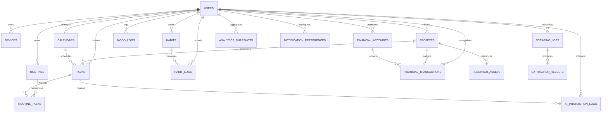

# Entity Relationship Diagram

## Indexing Highlights

- `tasks` keeps composite indexes on `(user_id, status, due_at)` and `(user_id, start_at)` to accelerate scheduling queries.
- `scraping_jobs` exposes `(status, next_run_at)` and `(user_id, status)` indexes for worker pickup and monitoring.
- Fact tables such as `habit_logs`, `mood_logs`, `extraction_results`, and `financial_transactions` include time-based indexes for analytics-friendly querying.

Render the diagram directly in GitHub (Mermaid is supported) or copy the block into any Mermaid-compatible viewer.
